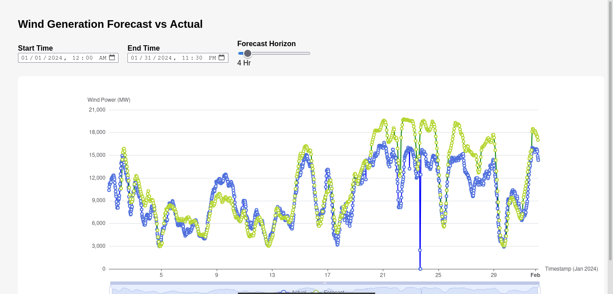

# REint Assignment

**Files and folders**

1. `forecast-monitor`: Contains the backend and frontend for the forecast monitoring application. Backend is using Golang and frontend is using HTML, CSS and JS.
2. `forecast_analysis.ipynb`: Contains the analysis for the forecast dataset. The dataset contains actual and forecast wind generation data. The goal of the analysis is to understand the error characteristics of the model.
3. `recommendation.ipynb`: Contains the analysis for how many MW of wind power can we reliably expect to be available to meet the electricity demand.

## Run the forecast monitoring application

Move to the `forecast-monitor/backend` folder,

```sh
cd forecast-monitor/backend
```

Run the server,

```sh
go run main.go
```

For the frontend, you can just move to `forecast-monitor/frontend` folder and open the `index.html` file. It will open the monitoring application with the following interface.


